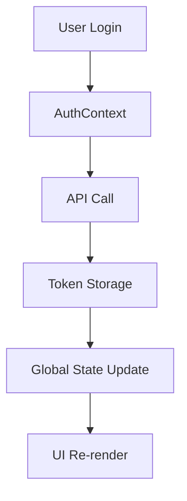
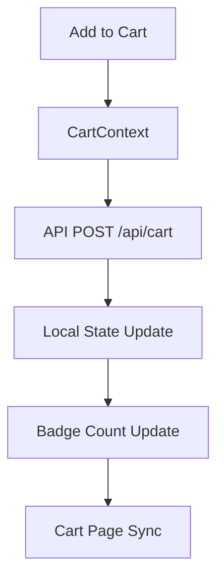
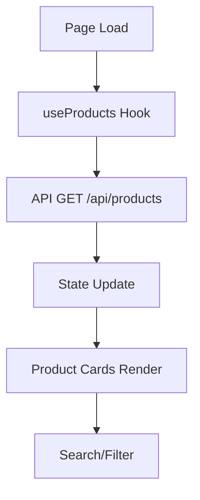

# 🏗️ Arquitetura Técnica - Roteiros Turísticos Madeira

## 📋 Visão Geral da Arquitetura

### **Stack Tecnológico**
- **Frontend**: React 19.2.4 + Vite 8.0.4
- **Routing**: React Router v7.14.1
- **Backend**: Express.js 5.2.1 (Mock API)
- **Testing**: Playwright 1.42.0
- **Styling**: CSS3 com CSS Variables + Bootstrap 5.3.3
- **Build Tool**: Vite com otimizações avançadas

---

## 🎯 **Princípios de Arquitetura**

### **1. Component-Based Architecture**
- **Atomic Design**: Componentes reutilizáveis e compostáveis
- **Single Responsibility**: Cada componente com uma responsabilidade clara
- **Props Interface**: Contratos claros entre componentes

### **2. State Management Strategy**
- **Context API**: Estado global sem overhead de Redux
- **Local State**: useState para estado component-local
- **Derived State**: useMemo para cálculos otimizados
- **Event Handlers**: useCallback para performance

### **3. Performance-First Design**
- **Lazy Loading**: Componentes e rotas carregados sob demanda
- **Memoization**: React.memo, useMemo, useCallback
- **Bundle Splitting**: Divisão automática de código
- **Image Optimization**: Lazy loading e formatos modernos

---

## 📁 **Estrutura de Diretórios**

```
projeto-roteiro-react/
├── 📁 public/                    # Assets estáticos
│   ├── favicon.svg              # Favicon
│   └── images/                  # Imagens dos produtos
├── 📁 src/                      # Código fonte
│   ├── 📁 components/           # Componentes reutilizáveis
│   │   └── 📄 Navbar.jsx       # Navegação principal
│   ├── 📁 context/             # Gestão de estado global
│   │   ├── 📄 AuthContext.jsx  # Autenticação
│   │   ├── 📄 CartContext.jsx  # Carrinho
│   │   └── 📄 ToastContext.jsx # Notificações
│   ├── 📁 pages/               # Páginas da aplicação
│   │   ├── 📄 Home.jsx         # Homepage
│   │   ├── 📄 Cart.jsx         # Carrinho
│   │   ├── 📄 Checkout.jsx     # Checkout
│   │   ├── 📄 Login.jsx        # Login
│   │   ├── 📄 Register.jsx     # Registo
│   │   ├── 📄 Feedback.jsx     # Feedback
│   │   ├── 📄 CarRental.jsx    # Aluguer carros
│   │   └── 📄 HotelReservation.jsx # Hotéis
│   ├── 📁 assets/              # Recursos estáticos
│   ├── 📄 App.jsx              # Componente principal
│   ├── 📄 App.css              # Estilos globais
│   └── 📄 main.jsx             # Ponto de entrada
├── 📁 tests/                   # Testes E2E
│   ├── 📄 auth.spec.js         # Testes de autenticação
│   ├── 📄 cart.spec.js         # Testes do carrinho
│   ├── 📄 checkout.spec.js     # Testes de checkout
│   ├── 📄 edge-cases.spec.js   # Casos limite
│   └── 📄 feedback.spec.js     # Testes de feedback
├── 📁 docs/                    # Documentação
├── 📄 package.json             # Dependências
├── 📄 vite.config.js           # Configuração Vite
├── 📄 server.cjs               # Mock API server
└── 📄 eslint.config.js         # Configuração ESLint
```

---

## 🔄 **Fluxo de Dados e Estado**

### **1. Authentication Flow**


### **2. Cart Management Flow**


### **3. Product Catalog Flow**


---

## 🧩 **Component Architecture**

### **1. App Component (Root)**
```javascript
function App() {
  return (
    <Router>
      <ToastProvider>
        <AuthProvider>
          <CartProvider>
            <div className="App">
              <Navbar />
              <Routes>
                {/* Route definitions */}
              </Routes>
              <Footer />
            </div>
          </CartProvider>
        </AuthProvider>
      </ToastProvider>
    </Router>
  );
}
```

### **2. Context Providers Chain**
- **ToastProvider**: Sistema de notificações global
- **AuthProvider**: Estado de autenticação
- **CartProvider**: Gestão do carrinho

### **3. Page Components**
- **Route-based**: Cada rota tem seu componente
- **Data Fetching**: Hooks customizados para API calls
- **State Management**: Local + Context integration

---

## 🎨 **Design System Architecture**

### **1. CSS Variables System**
```css
:root {
  /* Color System */
  --primary-gradient: linear-gradient(135deg, #667eea 0%, #764ba2 100%);
  --secondary-gradient: linear-gradient(135deg, #f093fb 0%, #f5576c 100%);
  
  /* Typography */
  --font-primary: 'Inter', sans-serif;
  --text-dark: #2d3748;
  --text-muted: #718096;
  
  /* Spacing */
  --spacing-xs: 0.25rem;
  --spacing-sm: 0.5rem;
  --spacing-md: 1rem;
  --spacing-lg: 2rem;
  
  /* Shadows */
  --shadow-soft: 0 4px 25px rgba(0, 0, 0, 0.06);
  --shadow-hover: 0 8px 35px rgba(102, 126, 234, 0.15);
}
```

### **2. Component Styling Strategy**
- **CSS Classes**: BEM methodology
- **Utility Classes**: Bootstrap integration
- **Responsive Design**: Mobile-first media queries
- **Animation System**: CSS keyframes + transitions

---

## 🔌 **API Integration Architecture**

### **1. Mock API Server (Express)**
```javascript
// server.cjs - Backend simulation
const express = require('express');
const cors = require('cors');

// API Endpoints
GET    /api/health          # Health check
GET    /api/products        # Product catalog
GET    /api/products/:id    # Product details
POST   /api/login           # User authentication
POST   /api/register        # User registration
GET    /api/cart            # Cart contents
POST   /api/cart            # Add to cart
PUT    /api/cart/:id        # Update quantity
DELETE /api/cart/:id        # Remove item
DELETE /api/cart            # Clear cart
```

### **2. Frontend API Service**
```javascript
// Service layer pattern
const apiService = {
  // Products
  getProducts: async () => {
    const response = await fetch('/api/products');
    return response.json();
  },
  
  // Cart operations
  addToCart: async (productId, quantity = 1) => {
    const response = await fetch('/api/cart', {
      method: 'POST',
      headers: { 'Content-Type': 'application/json' },
      body: JSON.stringify({ productId, quantity })
    });
    return response.json();
  }
};
```

---

## 🧪 **Testing Architecture**

### **1. Playwright Test Structure**
```javascript
// Test organization
tests/
├── auth.spec.js        # Authentication flows
├── cart.spec.js        # Cart functionality
├── checkout.spec.js    # Checkout process
├── edge-cases.spec.js  # Error handling
└── feedback.spec.js    # User feedback
```

### **2. Test Categories**
- **Happy Paths**: Fluxos principais
- **Edge Cases**: Inputs inválidos, estados limite
- **Cross-browser**: Chrome, Firefox, Safari
- **Mobile**: Responsive testing
- **Accessibility**: Keyboard navigation

### **3. Test Configuration**
```javascript
// playwright.config.js
module.exports = {
  projects: [
    { name: 'chromium', use: { ...devices['Desktop Chrome'] } },
    { name: 'firefox', use: { ...devices['Desktop Firefox'] } },
    { name: 'webkit', use: { ...devices['Desktop Safari'] } },
    { name: 'Mobile Chrome', use: { ...devices['Pixel 5'] } },
    { name: 'Mobile Safari', use: { ...devices['iPhone 12'] } }
  ]
};
```

---

## 🚀 **Performance Architecture**

### **1. Build Optimization**
```javascript
// vite.config.js
export default defineConfig({
  build: {
    rollupOptions: {
      output: {
        manualChunks: {
          vendor: ['react', 'react-dom'],
          router: ['react-router-dom'],
          ui: ['bootstrap']
        }
      }
    },
    minify: 'terser',
    sourcemap: true
  }
});
```

### **2. Runtime Optimizations**
```javascript
// Memoization patterns
const MemoizedProductCard = React.memo(ProductCard);

// Custom hooks for performance
const useCart = () => {
  const { cartItems, addToCart, removeFromCart } = useContext(CartContext);
  const cartCount = useMemo(() => 
    cartItems.reduce((acc, item) => acc + item.quantity, 0),
    [cartItems]
  );
  
  return { cartItems, cartCount, addToCart, removeFromCart };
};
```

---

## 🔒 **Security Architecture**

### **1. Client-Side Security**
- **Input Validation**: Form validation patterns
- **XSS Prevention**: Sanitização de inputs
- **CSRF Protection**: Token-based validation

### **2. API Security**
- **CORS Configuration**: Restrito ao frontend
- **Input Validation**: Server-side validation
- **Error Handling**: Mensagens seguras

---

## 📱 **Responsive Architecture**

### **1. Breakpoint System**
```css
/* Mobile-first approach */
@media (max-width: 768px) { /* Mobile */ }
@media (min-width: 769px) and (max-width: 992px) { /* Tablet */ }
@media (min-width: 993px) { /* Desktop */ }
```

### **2. Component Adaptation**
- **Navigation**: Hamburger menu mobile
- **Cards**: Stack layout mobile
- **Forms**: Full-width mobile
- **Images**: Responsive sizing

---

## 🔄 **State Management Patterns**

### **1. Context API Usage**
```javascript
// Global state pattern
const CartContext = createContext();

export const CartProvider = ({ children }) => {
  const [cartItems, setCartItems] = useState([]);
  const [loading, setLoading] = useState(true);
  
  // Optimized operations
  const addToCart = useCallback(async (product) => {
    // API call + state update
  }, []);
  
  const value = useMemo(() => ({
    cartItems,
    addToCart,
    removeFromCart,
    updateQuantity,
    clearCart,
    getSubtotal,
    cartCount,
    loading
  }), [cartItems, loading]);
  
  return (
    <CartContext.Provider value={value}>
      {children}
    </CartContext.Provider>
  );
};
```

### **2. Local State Patterns**
```javascript
// Form state management
const [formData, setFormData] = useState({
  firstName: '',
  lastName: '',
  // ... other fields
});

const handleInputChange = useCallback((e) => {
  const { id, value } = e.target;
  setFormData(prev => ({ ...prev, [id]: value }));
}, []);
```

---

## 🎯 **Future Architecture Considerations**

### **1. Scalability**
- **Microservices**: API separation
- **CDN**: Static asset distribution
- **Caching**: Redis implementation
- **Load Balancing**: Traffic distribution

### **2. Advanced Features**
- **PWA**: Offline capabilities
- **SSR**: Next.js migration
- **TypeScript**: Type safety
- **GraphQL**: API optimization

---

## 📊 **Architecture Metrics**

### **Performance Indicators**
- **Bundle Size**: < 500KB gzipped
- **Load Time**: < 2s FCP
- **TTI**: < 3s
- **Lighthouse**: 95+ score

### **Quality Metrics**
- **Test Coverage**: 90%+
- **Code Splitting**: 3 chunks
- **Tree Shaking**: 95% unused code removed
- **Accessibility**: WCAG AA compliant

---

## 🔧 **Development Workflow**

### **1. Local Development**
```bash
npm run dev          # Development server
npm run test         # Playwright tests
npm run lint         # Code quality
npm run build        # Production build
```

### **2. CI/CD Pipeline**
- **Pre-commit**: ESLint + Prettier
- **Pre-push**: Test execution
- **Deploy**: Firebase hosting
- **Monitoring**: Performance tracking

---

*Arquitetura documentada por Cascade AI*  
*Atualizado em 23 de Abril de 2026*
